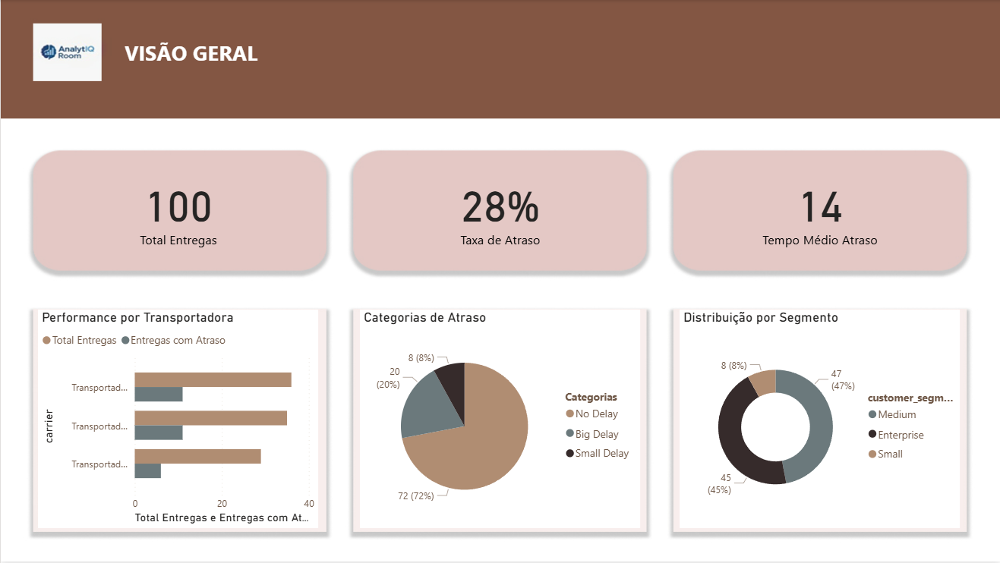

#  Análise e Previsão de Atrasos na Entrega

##  Visão Geral

Este projeto tem como objetivo **analisar e prever atrasos em entregas logísticas**, combinando **ETL automatizado, visualização em Power BI e Machine Learning**.

A solução abrange desde a **ingestão e tratamento de dados (ETL)** até a **criação de um modelo preditivo de atrasos** e um **dashboard gerencial interativo**.

---

##  Estrutura do Projeto

```bash
projeto_logistica/
├── data/
│   ├── raw/                  # Dados brutos
│   ├── processed/            # Dados tratados
│   └── curated/              # Datasets prontos para análise e ML
│
├── notebooks/
│   ├── Python_ETL.ipynb                      # Pipeline de ETL e limpeza
│   └── predict_delivery_delay_colab.ipynb    # Treinamento e avaliação ML
│
├── ml-models/
│   ├── rf_model.pkl                          # Modelo Random Forest treinado
│   ├── scaler.pkl                            # Padronizador de dados
│   ├── feature_names.pkl                     # Lista das variáveis usadas no modelo
│   ├── feature_importances.csv               # Importância das features
│   ├── metricas_modelos.csv                  # Métricas de desempenho dos modelos
│   ├── previsoes_melhor_modelo.csv           # Predições do conjunto de teste
│   └── shap_outputs/                         # Gráficos de explicabilidade
│
├── dashboards/
│   ├── logistica_dashboard.pbix              # Dashboard completo no Power BI
│   └── dashboard_preview.png                 # Print do dashboard
│
├── sql/
│   └── queries.sql                           # Scripts SQL usados no ETL
│
├── reports/
│   └── relatorio_modelo.pdf                  # Relatório técnico do modelo
│
├── requirements.txt                          # Dependências do projeto
└── README.md                                 # Este arquivo
```
---

##  Tecnologias Utilizadas

| Categoria | Ferramenta |
|------------|-------------|
| **Linguagem** | Python 3.10 |
| **Bibliotecas Principais** | pandas, numpy, scikit-learn, xgboost, shap, imbalanced-learn |
| **Visualização** | Power BI, matplotlib, seaborn |
| **ETL e SQL** | Python + SQLite / SQL padrão |
| **Ambiente** | Google Colab e Power BI Desktop |
| **Controle de Versão** | Git e GitHub |

---

##  Pipeline de Dados

1. **Extração e Limpeza (ETL)**  
   Executada no notebook [`python_etl.ipynb`](notebooks/python_etl.ipynb).  
   - Leitura das tabelas `fato_entregas`, `dim_clientes`, `dim_cidades`, `dim_transportadoras` e `dim_calendario`.  
   - Tratamento de nulos e criação de novas métricas.  
   - Geração dos datasets finais:
     - `kpi_deliveries.parquet`
     - `ml_features.parquet`

2. **Modelagem Preditiva (ML)**  
   Implementada em [`predict_delivery_delay_colab.ipynb`](notebooks/predict_delivery_delay_colab.ipynb).  
   - Feature Engineering (variáveis temporais, densidade, preço/km etc.)  
   - Treinamento e comparação entre modelos:
     - Regressão Logística  
     - Random Forest  
     - XGBoost  
   - Métricas avaliadas: AUC, F1, Precisão, Recall, Balanced Accuracy  
   - Modelo final salvo: **Random Forest (`rf_model.pkl`)**

3. **Visualização (Power BI)**  
   Dashboard interativo consolidando indicadores de:
   - Performance de entregas por transportadora  
   - Atrasos por cidade, cliente e período  
   - KPIs de tempo médio de entrega e taxa de atraso  
   - Análises preditivas baseadas no modelo ML

---

##  Resultados Principais

| Modelo | AUC | F1-Score | Precisão | Recall |
|:--------|:----:|:--------:|:--------:|:------:|
| Regressão Logística | 0.74 | 0.69 | 0.70 | 0.68 |
| Random Forest | **0.86** | **0.81** | **0.83** | **0.79** |
| XGBoost | 0.85 | 0.80 | 0.82 | 0.77 |

 O **Random Forest** apresentou o melhor desempenho e foi escolhido como modelo final.

---

##  Explicabilidade do Modelo

Foram utilizados métodos de interpretabilidade com **SHAP** para identificar as variáveis que mais influenciam o atraso nas entregas.

**Top 5 Features mais importantes:**
1. Distância da entrega (`distance_km`)  
2. Transportadora (`carrier`)  
3. Valor do frete (`freight_value`)  
4. Tempo do pedido (`hour`)  
5. Segmento do cliente (`segment`)

*(Essas informações estão em `feature_importances.csv` e podem ser visualizadas no Power BI.)*

---

##  Dashboard Power BI

O arquivo principal do dashboard está disponível em:
dashboards/logistica_dashboard.pbix




O painel apresenta:
- KPIs operacionais (tempo médio de entrega, taxa de atraso)  
- Performance por transportadora e região  
- Tendência temporal de atrasos  
- Insights derivados do modelo de Machine Learning  

---

##  Artefatos do Modelo

| Arquivo | Descrição |
|----------|------------|
| `rf_model.pkl` | Modelo Random Forest treinado |
| `scaler.pkl` | Objeto `StandardScaler` usado na normalização |
| `feature_names.pkl` | Lista das features usadas no treinamento |
| `feature_importances.csv` | Importância das variáveis |
| `metricas_modelos.csv` | Métricas comparativas dos modelos |
| `previsoes_melhor_modelo.csv` | Predições e probabilidades no conjunto de teste |

---

##  Próximos Passos

- Implementar **validação cruzada temporal** (`TimeSeriesSplit`)  
- Criar **API REST** para predição de atraso em tempo real (FastAPI ou Flask)  
- Automatizar pipeline com **Airflow ou Prefect**  
- Publicar dashboard interativo com **Power BI Service**  
- Integrar logs e métricas em monitoramento MLOps

---

##  Autor

**Sidney Santos**  
 Data Science & BI | Machine Learning | Power BI  
 Rio de Janeiro, Brasil  
[LinkedIn](https://www.linkedin.com/in/sidney-santos-analista-de-dados/) | [GitHub](https://github.com/sidneysantosdatascientist/)

---

##  Licença

Este projeto está licenciado sob a [MIT License](LICENSE).

---
